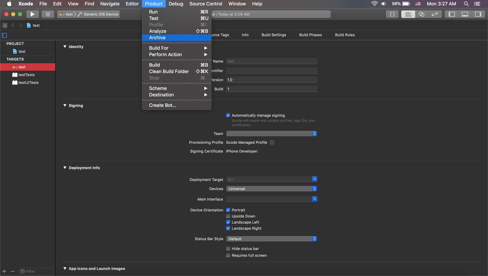
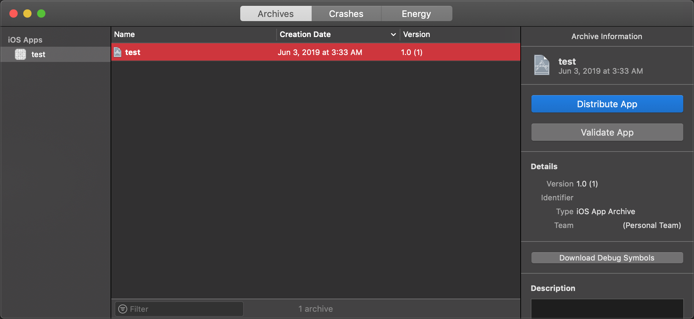
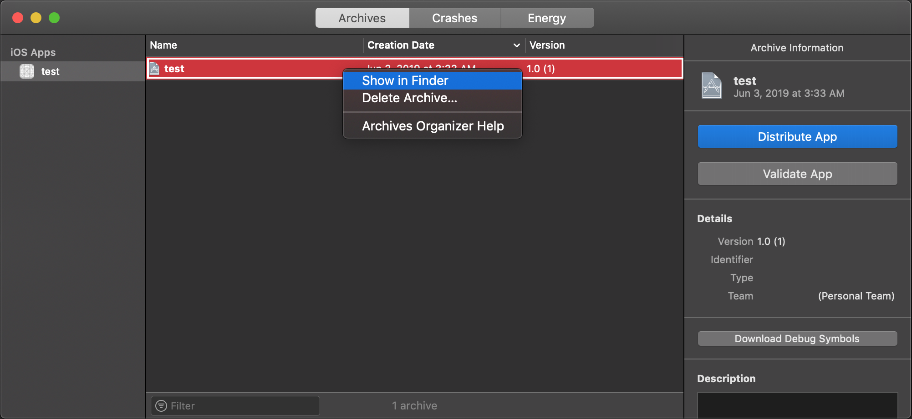
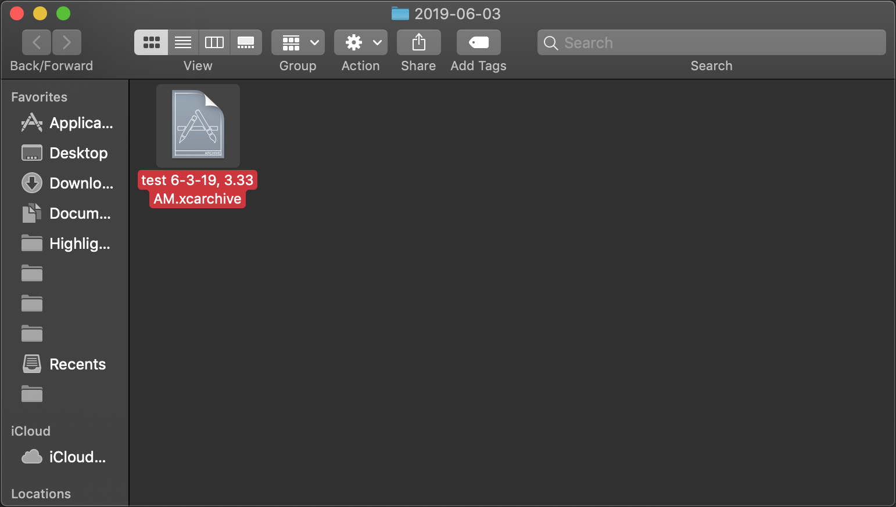
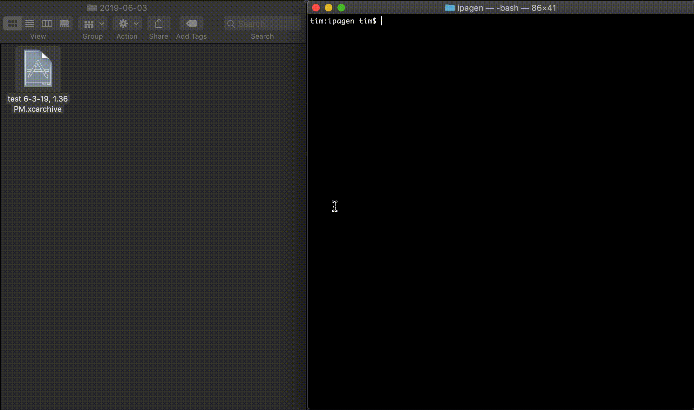
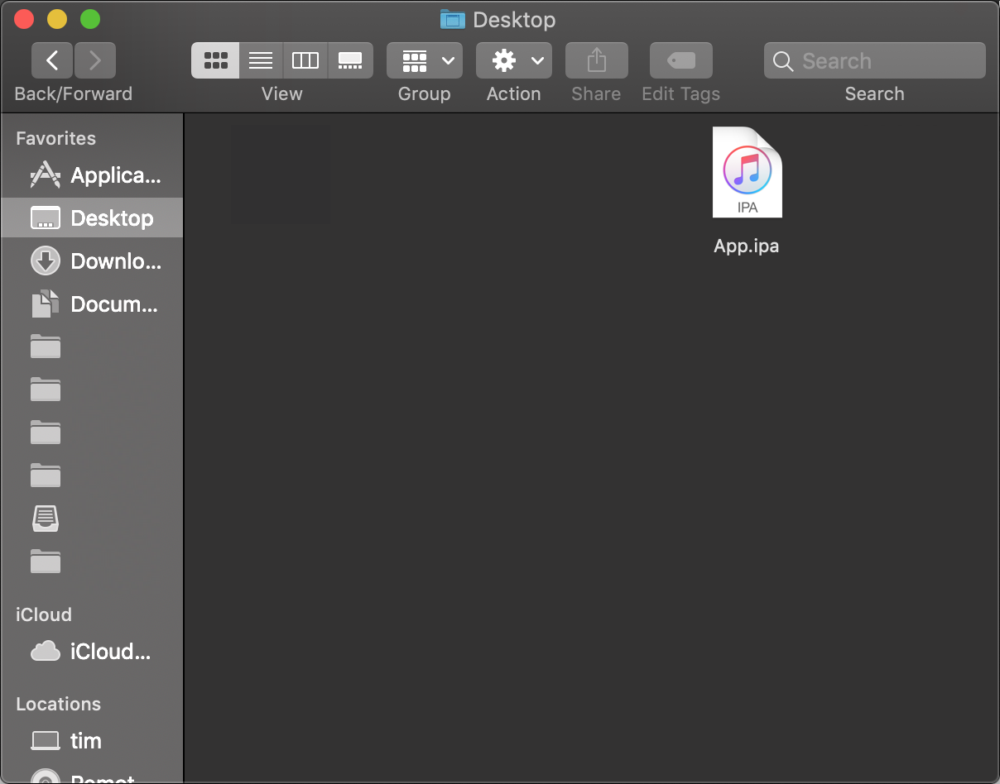

# ipagen

ipagen is a small script that converts an `.xcarchive` file to an `.ipa` that can be sideloaded onto your iPhone using an outside application such as <a href="http://www.cydiaimpactor.com/">Cydia</a> without the long steps and the need for an Apple Developer Account. Tested and works as of Xcode version 10.1.

## how-to-use

To get started, download the `ipagen.sh` script, or copy its contents into a text file. In order to make this file executable, open Terminal, `cd` to `ipagen.sh`'s directory and run
```
chmod 777 ipagen.sh
```
Then, open your Xcode project and archive it



Once the archiving process is completed, a new window will pop up with the newly archived file



Right click on that new file, and select "Show in Finder"



The `.xcarchive` file will now be shown



Using your Terminal session input `./ipagen.sh` as such
```
$ ./ipagen.sh <file-path>
```
Fill in this `<file-path>` with the path of your `.xcarchive` by dragging it from Finder to the Terminal. Then run the script



Once the script is finished, the newly generated `App.ipa` file should be sitting in your `Desktop` directory, ready to be sideloaded through Cydia.


